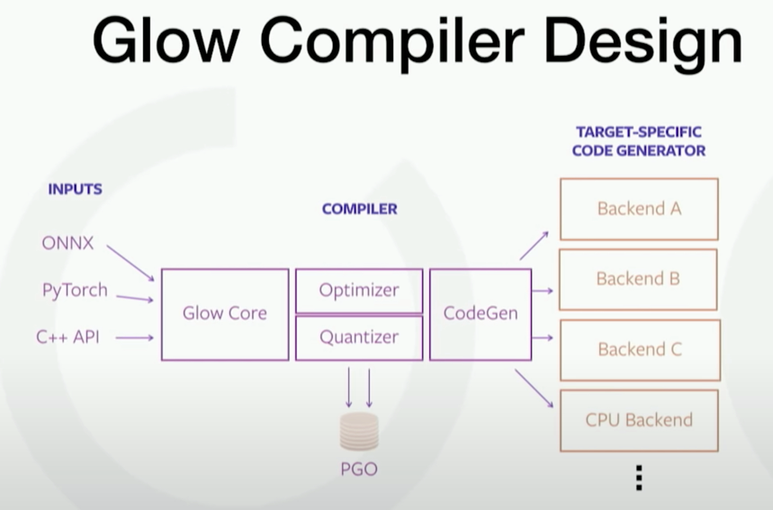
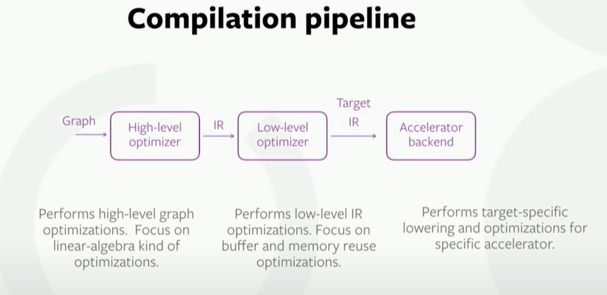

# MO436-MC934 -- Machine Learning under the hood

Machine Learning (ML) has become a central area in modern computing. The number
of applications using ML models has grown exponentially, and as such the demand
for engineers who know how to pilot  toolchains  like PyTorch, TensorFlow, etc.
On the other hand, there is much more interesting knowledge in ML than just
learning how to apply it to a problem. Computing a ML model graph is
a computational intensive task that requires a number of optimization and
parallelization algorithms that are hidden from the typical user. Understanding
these algorithms is a central tool for the  modern data-scientist,  as it
highlights the professional from the crowd of people working in this area.

In this course we will cover the most important algorithms for parallelization
and optimization that are used to compute  ML graphs. This will be done by
looking under the hood of three major ML Engines: (a) Facebook Glow; (b)
Google's TensorFLow XLA; and (c) Google JAX.

[Glow](https://github.com/pytorch/glow) is a machine learning compiler from
Facebook that accelerates the performance of deep learning frameworks on
different hardware platforms. In this course we will study how the Glow
framework works, and show how to use quantization to generate code for a model
in a NeuroMorphic Processor (NMP).

[XLA](https://www.tensorflow.org/xla) (Accelerated Linear Algebra) is
a domain-specific compiler for linear algebra, from Google, that can accelerate
TensorFlow models. It leverages on the effcient partitioning of tensor data
across the memory hierarchy of a processor to generate high-performance code.
In this course we will study XLA HLO graph representation, and show how to
generate efficient code for operators like convolution.

[JAX](https://github.com/google/jax) (Just After Execution) is a Python library
and JIT compiler designed by Google to speedup high-performance numerical
computing and machine learning applications. It has been extensively used  by
DeepMind in its projects, and leverages on Google TensorFlow XLA to generate
efficient code for CPUs/GPUs. In this course we will explain JAX in details and
discuss how model graphs can be parallelized in a cluster.

This course is divided into five sections, namely:

## Section 1: ONNX

In 2017, AWS, Microsoft, and Facebook came together to launch the Open Neural
Network Exchange (ONNX), which became a standard for ML interoperability. ONNX
has two components: a common set of operators and a common file format.
Operators are the building blocks of machine learning and deep learning models.
By standardizing a common set of operators, ONNX makes it easy to consume deep
learning models trained in any of the supported frameworks. It defines an
extensible computation graph model, as well as definitions of built-in
operators and standard data types.

The common file format of ONNX becomes the lowest common denominator to
represent a model. Once a model is exported to ONNX, irrespective of the
framework it is trained in, it exposes a standard graph and set of operators
based on the specification. Every model is converted into a standard
intermediate representation (IR) that is well-defined and well-documented. By
providing a common representation of the computation graph, ONNX helps
developers choose the right framework for their task, allows researchers
to focus on innovative enhancements, and enables hardware vendors to streamline
optimizations for their platforms.

The syllabus for this section is available in [ONNX
Section](https://github.com/MO436-MC934/notebooks/wiki/1.ONNX-Model#1open-neural-network-exchange--onnx)
in the Wiki.

## Section 2: The GLOW Plataform

Glow is a machine learning compiler and execution engine for hardware
accelerators. It is designed to be used as a backend for high-level machine
learning frameworks. The compiler is designed to allow state of the art
compiler optimizations and code generation of neural network graphs.

### How does it work?

Glow lowers a traditional neural network dataflow graph into a two-phase
strongly-typed [intermediate
representation](https://github.com/pytorch/glow/blob/master/docs/IR.md) (IR).
The high-level IR enables the optimizer to perform domain-specific
optimizations. The lower-level instruction-based address-only IR allows the
compiler to perform memory-related optimizations, such as instruction
scheduling, static memory allocation and copy elimination. At the lowest level,
the optimizer performs machine-specific code generation to take advantage of
specialized hardware features.

Glow features a lowering phase which enables the compiler to support a high
number of input operators as well as a large number of hardware targets by
eliminating the need to implement all operators on all targets. The lowering
phase is designed to reduce the input space and enable new hardware backends to
focus on a small number of linear algebra primitives. Glow's design philosophy
is described in an [arXiv](https://arxiv.org/abs/1805.00907) paper.

Convolution if the most computing-intensive operation in a computational graph
and thus is a central component of any DNN model. Therefore, understanding the
implementation of convolution is an important knowledge for any data-scientist.

This section's assignment will explore the design of the convolution operator.
Students will be required to design their own convolution, and compare its
performance with the convolution available in Glow.

The syllabus for this section is available in [Glow
Section](https://github.com/MO436-MC934/notebooks/wiki/2.Glow-PLatform#2-glow-platform)
in the Wiki.

## Section 3: GEMM Optimization

As discussed in the previous section Convolution if the most computing-intensive
operation in any DNN model. A typical way to implement convolution is to convert
it to a sequence of two tasks: image to column (im2col), followed by a Generic
Matrix-Matrix Multiply (GEMM). The im2col operation converts both the filters
and the input image to two matrices which are then multiplied using GEMM.
Performing an efficient GEMM is therefore the most relevant task to be achieved
when executing a convolution. This section will detail the Goto et al. algorithm
and explain how it can be used to design performant GEMMs, like those available
in OpenBLAS, Eigen, and MKL optimization libraries.

This section  will explore the design and optimization of a GEMM operation.
Students  will measure the speedup achieved by substituting the Convolution
previously designed in Section 2, by an im2col operation followed by a call to
the OpenBLAS GEMM.

The syllabus for this section are available in [GEMM
Section](https://github.com/MO436-MC934/notebooks/wiki/3.GEMM-Optimization#3-gemm-optimization)
in the Wiki.

## Section 4: Slicing and Tiling

TODO

The syllabus for this section is available in [ML Code
Section](https://github.com/MO436-MC934/notebooks/wiki/4.ML-Code#4-ml-code-optimization)
in the Wiki.

## Section 5: The JAX Library

Extracting parallelism from modern hardware requires extensive expertise in
computer architecture and parallel programming. In this context, established
frameworks provide well-optimized kernels for each common operation for each
hardware. However, experiment with non-conventional operations makes it hard to
leverage the performance of existing frameworks.

In this section, we will explore the JAX library that allows arbitrary native
Python code to be just-in-time compiled and optimized with the XLA compiler.
This enables the engineer to use their familiarity with Python to implement
performant operations with minimal code changes. JAX, for the most part,
abstracts the details of writing high-performance code away from programmers. On
top of that, users can also use the auto-differentiation mechanism to compute
gradients and jacobians of mathematical functions, both of which are extensively
used in ML and other scientific fields.

The syllabus of this section is described in [JAX
Library Section](https://github.com/MO436-MC934/notebooks/wiki/5.JAX-Library#5-the-jax-library)
in the Wiki.

